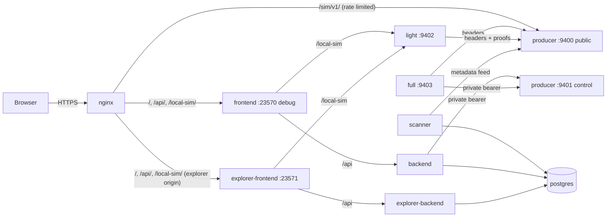

# Experimental simulator deployment

Two public origins serve one unsigned durable simulator run from the host
`geode` (65.109.154.126):

| Origin | Serves | Backend |
| --- | --- | --- |
| https://experimental.arkiv-global.net | Debug console (`VITE_UI_MODE=debug`), Google administrator login, producer controls, and the producer's **public node listener** under `/sim/v1/` | `backend` (control listener and OAuth configured) |
| https://explorer.experimental.arkiv-global.net | Independent read-only explorer over the PostgreSQL projection (`VITE_UI_MODE=explorer`) | `explorer-backend` (no controls, no login) |

Both are containers of the same Compose project built from
`compose.simulator.yml` in this checkout
(`/home/ubuntu/arkiv-network/arkiv-chain-indexer-experimental`, branch
`experimental`) and the sibling Rust checkout
`/home/ubuntu/arkiv-network/arkiv-db-pure-astra` (branch `main`). The state
directory is `/home/ubuntu/.config/arkiv-simulator/experimental` (mode 0700);
its Compose project name is derived from that path (`arkiv-sim-666374b2c8`).

The run is **unsigned**: no blockchain, transaction or producer signatures
exist. Trust is the configured source. Equality proofs shown as verified were
checked by the deployment's own light follower against the pinned unsigned
root; both hosted UIs label this **server-side**. Nothing in a browser verifies
anything. The genuinely local workflow is a light process on the user's machine
pinned to this run's identity and pointed at the public node endpoint (see
[the run guide](simulator-run.md#remote-source-and-local-verified-view)); the
debug console prints the exact command with the current pins.

## Architecture and routing



nginx sites (symlinked into `sites-enabled`, TLS added by certbot):

| Site file | Location | Upstream |
| --- | --- | --- |
| `/etc/nginx/sites-available/experimental.arkiv-global.net` | `/sim/v1/` | `127.0.0.1:9400` producer public listener; `limit_req` 10 r/s per address (burst 20) and `limit_conn` 8 from `/etc/nginx/conf.d/arkiv-simulator-experimental.conf` |
| | `= /api/metrics` | 404 |
| | `^~ /api/auth/` | `127.0.0.1:23570`, access log off, no caching |
| | `/api/`, `/local-sim/`, `/` | `127.0.0.1:23570` (debug frontend container, which proxies `/api` to `backend:3000` and `/local-sim` to `light:9402`) |
| `/etc/nginx/sites-available/explorer.experimental.arkiv-global.net` | same layout without `/sim/v1/` | `127.0.0.1:23571` (explorer frontend, proxying to `explorer-backend:3000` and `light:9402`) |

Published host ports are loopback only: `9400` (producer public listener),
`23570` (debug UI) and `23571` (explorer UI). PostgreSQL, the producer's
control/replication listener (`9401`), the light follower (`9402`) and the full
follower (`9403`) exist only on the Compose network. The public node listener
refuses control and replication paths; canonical bodies are served only on the
private listener to the full follower with the private bearer.

Containers, restart policy `unless-stopped`, health checks on every service:

| Service | Role | Data |
| --- | --- | --- |
| `postgres` | projection database | volume `simulator-postgres` |
| `producer` | unsigned block producer, `--start running` so a restarted container resumes production | volume `simulator-node` (`node.redb`) |
| `full` | independently executing full follower (replication over the private bearer) | volume `simulator-full` |
| `light` | header-only light follower and server-side Eq verifier | volume `simulator-light` (`headers.redb`) |
| `scanner` | metadata feed ingestion into schema `sim_v1` | postgres |
| `backend` / `frontend` | debug API (controls, OAuth) and debug console | — |
| `explorer-backend` / `explorer-frontend` | read-only explorer API and UI | — |

## Configuration and secrets

`/home/ubuntu/.config/arkiv-simulator/experimental/.env.simulator.local`
(mode 0600) holds every private value: PostgreSQL password, control/replication
bearer, Google OAuth client ID and secret, the exact `AUTH_PUBLIC_ORIGIN`
(`https://experimental.arkiv-global.net`), the identity pins (`SIMULATOR_SOURCE_ID`,
`SIMULATOR_RUN_ID`, `SIMULATOR_GENESIS_HASH`, `SIMULATOR_CHAIN_ID`) and the
deployment switches (`SIMULATOR_UI_MODE=debug`, `SIMULATOR_HOSTED_EXPLORER=true`,
`SIMULATOR_PRODUCER_START=running`, `SIMULATOR_VERIFIER_LOCATION=server`, public
node and peer UI URLs). The launcher reads it with `--env-file`; nothing is
passed on command lines, printed, or written into images or browser bundles.
`AUTH_TOKEN_LOGIN_ENABLED` and `AUTH_INSECURE_LOCALHOST` are `false` and must
stay so on this origin.

The deployment-only inputs were supplied once through
`/home/ubuntu/.config/arkiv-simulator/experimental.private-env` (also 0600)
with `scripts/simulator.py init --private-env`; keep it in sync if the OAuth
client changes. The Google Cloud OAuth client must list
`https://experimental.arkiv-global.net/api/auth/google/callback` as an
authorized redirect URI. Administrator role is granted to the allowlisted
address with a verified email and the signed `hd=golem.network` claim; every
other Google account only gets identity and logout.

Back up the private file together with the volumes: the volumes are useless
without the pins and the database password, and `init` refuses to rebind an
existing database to a new run.

## Operations

Run everything from the checkout with the deployment's state directory:

```sh
cd /home/ubuntu/arkiv-network/arkiv-chain-indexer-experimental
SIM="python3 scripts/simulator.py --state-dir /home/ubuntu/.config/arkiv-simulator/experimental"
$SIM status                          # producer identity, head, health, storage bytes
$SIM compose ps                      # container health
$SIM compose -- logs --tail 100 scanner
$SIM control pause                   # operator controls over the private listener
$SIM control step
$SIM control resume
$SIM stop                            # stop every container; volumes and history retained
$SIM up                              # reopen the same run (verifies pins, rebuilds changed images)
```

`compose` is a passthrough with the right env file, project name and profiles;
put `--` before compose arguments that start with a dash. The producer's
`--start running` policy means `up` resumes production; use `control pause`
first when a paused reopen is wanted. Docker restarts (`compose restart` or a
host reboot) reopen the same run from the retained files without replay; the
scanner resumes at its contiguous head and the followers at their catalogs.

Public URLs to watch: `https://experimental.arkiv-global.net/api/sim/v1/nodes`
(live topology, lag and PostgreSQL size), `/api/health` on both origins,
`https://experimental.arkiv-global.net/sim/v1/status` (public node listener).
Prometheus can scrape `backend:3000/metrics` from the Compose network or
`/api/admin/metrics` with an administrator token; `/api/metrics` is 404 publicly.

### Update

```sh
cd /home/ubuntu/arkiv-network/arkiv-db-pure-astra && git pull --ff-only origin main
cd /home/ubuntu/arkiv-network/arkiv-chain-indexer-experimental && git pull --ff-only origin experimental
bun --no-env-file test ./src ./frontend && bun --no-env-file run typecheck
$SIM up                              # rebuilds changed images and recreates changed containers
$SIM compose ps
```

`up` never touches volumes. A change to the storage or wire profile is a new run
by design (the node refuses incompatible files); such a change needs a new state
directory, a new database schema or both, announced ahead of time.

### Rollback

Check out the previously deployed commits in both repositories (the commit IDs
are recorded below and in `git log`) and run `$SIM up`; images are rebuilt from
the checked-out sources and containers recreated. The retained data is
compatible in both directions within the same storage/wire profile. If a newer
projection schema was introduced with `SIMULATOR_SCHEMA`, restore the previous
schema name in the private file before `up`; the old schema is still present
because nothing deletes history.

### Backup and restore

Stop the stack for a consistent copy (`$SIM stop`), then archive the private
files and the four volumes:

```sh
BACKUP=/home/ubuntu/backups/arkiv-simulator-$(date +%Y%m%d-%H%M%S); mkdir -p "$BACKUP"; chmod 700 "$BACKUP"
cp -a /home/ubuntu/.config/arkiv-simulator "$BACKUP/config"
for v in simulator-postgres simulator-node simulator-full simulator-light; do
  docker run --rm -v arkiv-sim-666374b2c8_$v:/data:ro -v "$BACKUP":/backup alpine \
    tar -C /data -czf /backup/$v.tgz .
done
$SIM up
```

A running online copy of PostgreSQL is possible with
`$SIM compose -- exec -T postgres pg_dump -U simulator -Fc simulator > "$BACKUP/simulator.dump"`;
the node files must be copied stopped (redb keeps the file locked while open).
To restore, stop the stack, recreate each volume from its archive
(`docker run --rm -v arkiv-sim-666374b2c8_$v:/data -v "$BACKUP":/backup alpine tar -C /data -xzf /backup/$v.tgz`),
restore the config directory, and run `$SIM up`. Restoring the node volume alone
rolls the producer back to the archived height; the projection and followers
detect a conflicting known header if the producer later diverges, so restore
all four volumes from the same backup.

### Recovery

- **Scanner fenced** (`health` in `/api/sim/v1/nodes` is `IdentityMismatch`,
  `ChainConflict`, `UnsupportedVersion` or another permanent code): the scanner
  stops and keeps the retained projection readable. Review the producer's
  identity and logs. To rebuild deliberately, set a fresh `SIMULATOR_SCHEMA`
  (`sim_...`) in the private file and run `$SIM up`; the new schema is ingested
  from genesis while the old one stays. There is no clear-fence endpoint.
- **Follower conflict** (`chain-conflict` or `storage-fenced` health): the
  follower froze its catalog on an observed conflicting header. Inspect
  `compose -- logs light` / `full`; a fresh follower directory means a new
  volume name in `compose.simulator.yml` for that service only.
- **Producer `storage-fenced`**: an uncertain commit; the producer keeps the
  last acknowledged head. Restart the container (`$SIM compose restart producer`)
  so the redb recovery boundary reconciles the prepared batch; never delete the
  node file.
- **Disk full**: production halts without pruning; free space and restart the
  producer. Retained history grows roughly 9 MiB per 1,000 blocks in `node.redb`
  and 5 MiB per 1,000 blocks in PostgreSQL at the default workload.
- **Lost private file**: without the pins and password the volumes cannot be
  reattached; restore the file from backup. Never `docker compose down -v`.
- **Certificates**: `/etc/cron.d/certbot-renew` runs `certbot renew` twice a day
  and reloads nginx; `sudo certbot renew --dry-run --cert-name experimental.arkiv-global.net`
  checks the path.

## Validation procedure

After every update, in a real browser on both origins:

1. Pages load over HTTPS with no console errors; `/api/health` answers
   `sourceKind: arkiv-native-simulator`; no request goes to Ethereum routes
   (`shadow-rpc`, `baseload`, `batcher`, `faucet`, `rpc-keys`).
2. The topology cards show the producer advancing and the followers and the
   explorer catching up (lag returns to 0 within seconds).
3. Without a session the debug console shows no control buttons and
   `POST /api/admin/sim/v1/control` answers 401; the explorer origin answers 503
   (no login configured). With the administrator's Google session, pause, step
   and resume work and the command result names the new head and revision.
4. Historical queries: block 8 deletes an incarnation and block 9 recreates the
   key with a new ID; block 14 expires an earlier row. Record lookups at heights
   7, 8, 9 and 13, 14 show the incarnation disappearing while its operation
   history stays.
5. `Verify Eq (server-side)` at height 18 for `group u64 1` returns five IDs
   over pages of 3 and 2 with proof size and timings; a mutated verifier
   response is rejected with `VerifierBindingMismatch` and no rows.
6. A pinned page keeps its snapshot height while new blocks arrive.
7. `$SIM stop && $SIM up` keeps the same run ID, genesis hash and block hashes.
8. `ss -tlnp` shows only loopback `9400`, `23570`, `23571` for this project.
9. Hosted pages say server-side; a launcher-run local stack says local.

## Validation record (2026-09-24)

`scripts/checkSimulatorDeployment.ts` (Chrome via Playwright, run on the host
against the public origins with `--state-dir` and `--restart`) passed every
step of the procedure above on the first deployed run
(`sourceId b8f801fc-34ad-475c-b719-59128ff198dc`, `runId d0e9cfc7942a84f952720274e197229b`,
genesis `0x859817c2…d2b9d`, chain 9001):

| Check | Observation |
| --- | --- |
| TLS, assets, routing | Both origins serve Let's Encrypt certificates with HTTP→HTTPS redirects; `/api/health` reports the native source on both; `/api/metrics` is 404; the public node route refuses `replication` and `control` paths; no page errors, no Ethereum routes requested |
| Production and catch-up | Producer 577→581 in five seconds with full follower, light follower and explorer projection at the same height |
| Controls | Without a session: no control buttons, `POST /api/admin/sim/v1/control` 401 (explorer origin 503, no login configured). Operator CLI: pause held the head at 592, step committed 593 and the explorer indexed it, resume continued production |
| History | Key `0x372d…6564`: incarnation 2 live at 7, absent at 8 with the applied `deleteRecord` in its history, incarnation 3 live at 9. Key `0x372d…7265`: incarnation 1 live at 13, absent at 14 with the applied `expireRecord` |
| Proofs | Height 18, `group u64 1`, page 3: unverified projection IDs 3,4,5; server-side verification returned the same IDs with a 3.2 KiB proof and timings, then 6,7 on the continuation. A verifier response mutated to height 17 was rejected as `VerifierBindingMismatch` with no rows and no badge |
| Pinned pagination | Blocks page pinned at 587 stayed at 587 across two further pages (3,4,5 / 6,7,8) while the producer advanced to 591 |
| Restart | `stop` then `up`: same run ID and genesis, block 594 hash unchanged in the projection and on the public node, production resumed automatically, all services healthy |
| Ports | Only loopback 9400, 23570 and 23571 are published; the public address refuses every one of them |
| Labels | Hosted pages say server-side everywhere; the localhost harness (`scripts/testSimulatorIntegration.ts`) keeps the local wording |

Not exercised: a real Google account login on the public origin. The OAuth start
redirect is correct (exact callback, PKCE, state, nonce), but Google answers
`redirect_uri_mismatch` for `https://experimental.arkiv-global.net/api/auth/google/callback`
until that URI is added to the OAuth client in Google Cloud Console; the
administrator browser path (step, pause, resume, configure) is covered by the
localhost harness with the same frontend/backend code.

## Deployed revisions

- arkiv-db-pure-astra `main` @ `82fe3493fad2d5c75f66365026e892d249a3ee02`
  (status storage bytes, verified-page diagnostics, `--start`, curl in the image).
- arkiv-chain-indexer `experimental`: the commit that added this runbook and the
  debug console (see `git log -- docs/simulator-deployment.md`); images are built
  from the checkout at that commit.
