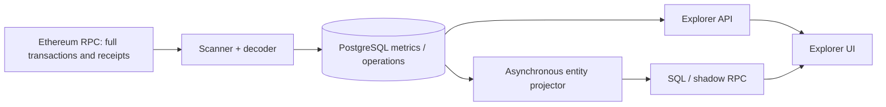
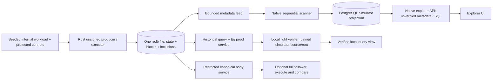

# Native chain simulator integration proposal

Status: implemented on `arkiv-chain-indexer-experimental/experimental` and the
Rust playground `main`, 2026-09-24. Cross-repository implementation was explicitly
authorized after review. See [the runnable guide](simulator-run.md),
[acceptance evidence](simulator-acceptance.md), and
[measured 10,000-block results](simulator-measurements.md).

Implementation decisions: the bounded selected genesis serves one complete 4 MiB
metadata block, with a prepublication transportability gate, instead of fragmented
1 MiB sections. SQL/proof responses remain separate. Native statistics are atomic
progress counters and bounded indexed reads; native responses use ordinary JSON
without adding another caching/aggregation daemon. The operation DTO references
its parent transaction for actor/request identity and keeps terminal after-images
separate from ordered outcomes. The internal v1 trace emits no pricing-admin work.
These concrete choices supersede the earlier optional transport/UI sketches.
The volatile preview slice was skipped: the delivered host is durable.
Node baseline: [`arkiv-db-pure-astra@63d8548`](https://github.com/Arkiv-Network/arkiv-db-pure-astra/tree/63d8548).

## Decision and minimum useful result

Build a native, explicitly **unsigned simulator** around the Rust block executor,
with one internal ordered producer. Keep PostgreSQL as a rebuildable explorer
projection. Add a small versioned metadata feed and simulator API rather than
make the Rust node emulate Ethereum. Reuse the explorer shell, authentication,
cache/compression and monitoring infrastructure; replace Ethereum-specific
metrics, transaction decoding and entity folding in this mode.

The minimum accepted simulator has a durable producer, all committed blocks
available from genesis, block/transaction/operation and namespace/record pages,
a repeatable workload, pause/step/resume controls, restart/resume, and a local
light process verifying the existing complete equality proofs against an
explicitly trusted simulator header/root. A volatile vertical slice can precede
it, but must advertise its run lifetime and is not the durable acceptance gate.

No consensus, block/producer/transaction signatures, public transaction mempool,
Ethereum JSON-RPC compatibility, pruning or compaction are added. Existing
signed full/light demo behavior and existing OAuth/admin transport controls
remain separate. Abstract engine units are not gas, wei, fees or token balances.

## What exists and why an adapter alone is insufficient

| Inspected code | Existing contract | Integration consequence |
| --- | --- | --- |
| [`src/scanner.ts`](../src/scanner.ts), [`rpc.ts`](../src/rpc.ts), [`blockInspector.ts`](../src/blockInspector.ts), [`arkivOperations.ts`](../src/arkivOperations.ts) | Fetches full Ethereum transactions, sequential receipts and external decoder output; computes gas/wei and input/compression sizes | Native scanner consumes committed metadata pages; no `eth_*`, ABI decoder, receipt fan-out or raw transaction input |
| [`src/storage.ts`](../src/storage.ts) | Block, transactions, operations and progress commit in one PostgreSQL transaction; existing rows can be replaced on rescan | Preserve atomic progress, but add strict immutable native block identity checks and a separate schema |
| [`src/entityIndex.ts`](../src/entityIndex.ts), [`entityIndexStorage.ts`](../src/entityIndexStorage.ts), [`entityProjector.ts`](../src/entityProjector.ts) | Ethereum entity keys, owner/creator, non-recreation assumption, receipt-log expiry with heuristic fallback, asynchronous folding/backfill | Do not feed native operations into this fold; use explicit native terminal changes and namespace-local record IDs |
| [`src/arkivJsonRpc.ts`](../src/arkivJsonRpc.ts), [`entityQuerySql.ts`](../src/entityQuerySql.ts) | Rich PostgreSQL reads with their own projection coverage and cursor order; not cryptographic proofs | Keep simulator SQL reads explicitly unverified and separately versioned |
| [`frontend/src/api.ts`](../frontend/src/api.ts), [`App.tsx`](../frontend/src/App.tsx) | Ethereum metrics and entity DTOs; compact list expansion, explorer views and admin gating | New capability discriminator and native DTOs; reuse presentational parts without invented Ethereum fields |
| Rust `crates/arkiv-node/src/{block,exec,select,identity,replay}.rs` | Canonical protocol-2 headers/roots, ordered execution, rollback receipts, expiry, request identities; `execute_block` accepts an engine `Branch` | Reuse the executor and canonical objects unchanged; replace the volatile publication/catalog host |
| Rust `crates/arkiv-node/src/demo/{auth,runtime,wire,workload}.rs` | Signed header wrapper, bounded HTTP, volatile `MemoryChain` and growing header/body/request collections | Add a separate unsigned simulator host/wire profile; do not make `SignedHeader::authenticate` optional |
| Rust `crates/arkiv-db/src/durable/` | Durable engine manifests and lazy state; one writer, bounded object cache/staging, conservative uncertain commits | Does not persist node bodies, height-to-snapshot mapping, request inclusions, or node publication/outbox by itself |

The indexer already forbids storing transaction calldata/entity payloads, including
reference-mode bytes. This proposal removes the *fetch/decode requirement* from
native ingestion. It does not claim to be removing a payload database that exists
today. Canonical operations still need their actual values inside the Rust node
for execution, body hashes, replay and independently executing full followers.

## Before and after





Rust state is authoritative. Its committed block catalog is the durable feed
outbox. PostgreSQL can be dropped and rebuilt by reading height 0 onward; it is
not consulted for executing a block, choosing state roots, or verifying proofs.
The feed is trustworthy only to the extent its configured source is trusted;
metadata pages are not inclusion proofs merely because they carry block hashes.
Select the source once at startup with `SOURCE_KIND=ethereum|native-simulator`
(default `ethereum`); native mode requires expected source/run/genesis and its
feed origin. Branch before constructing `ScannerStorage`, Ethereum RPC/decoder,
legacy projector, aggregators or passthrough in `index.ts`/`serve.ts`. Simply adding
routes while those constructors still run would leave hidden Ethereum dependencies.

## Identity, versions and trust

A run is `(sourceId, runId, genesisHash)`. `sourceId` is a provisioned lowercase
UUID naming a deployment; `runId` is a fresh random 128-bit lowercase hex value
created once when initializing its data directory. Neither changes on restart.
`genesisHash` is the existing canonical node genesis-header hash. `chainId` alone
is insufficient. Persist canonical genesis, the node/engine genesis association,
run identity and format versions together at initialization. Set engine genesis limits/pricing
from the node genesis and derive its deployment ID as
`digest("arkiv/simulator-engine/v1", encode(nodeGenesisHash) || runIdBytes)`;
persist/check the association without adding deployment identity to state roots. Verify them on every
open and every scanner/light handshake. Endpoint URL is configuration, not identity.

Reset creates a new directory/run and an explicit new PostgreSQL run partition;
it never truncates/reuses an existing run or silently continues an old cursor.
Identical deterministic genesis/workload can produce identical block hashes in
two runs: run identity still separates observations, controls, caches and progress.
No reset API in the first version; provide an explicit stop/new-directory workflow.

Separate version fields:

- `apiVersion: 1`, `feedVersion: 1`, `projectionVersion: 1` for these contracts.
- Existing node block format 1, protocol 2/header 2; codec/state versions stay
  those of the canonical Rust types. No JSON rehashing of headers or transactions.
- `authentication: "unsigned-simulator-v1"`, never a missing/zero signature in a
  signed envelope. Require the new simulator binary/profile and explicit
  `--unsigned-simulator` opt-in; existing signed-demo requests cannot negotiate down to this.
- `proofProfiles: ["eq-page-v1"]` describes the current bounded complete equality
  profile, not proof support for arbitrary SQL or engine queries.

The light process is configured with the genesis/run identity and a trusted
source endpoint (loopback by default; explicitly configured HTTPS remotely).
It checks strict header decoding, canonical hashes, parent/height/timestamp rules
and pins the accepted header/root before verifying a query. Conflicting hashes at
a known height freeze that source/run; never silently replace local history.
A chain of unsigned hashes is not consensus or producer authentication. A malicious
configured source can invent an internally consistent chain; an attacker replacing
the initial trust root is outside the proof's guarantee. UI text must say
“proof verified against trusted simulator root; unsigned source”.

Transport/admin authentication is independent: preserve Google OIDC validation,
sessions, role checks, CSRF and exact Origin requirements. Remote production and
control use TLS. Native controls are never exposed through the public shadow RPC
or an unrestricted URL proxy. The public API cannot choose an arbitrary producer
URL; the backend uses an operator-configured allowlisted origin. In simulator mode
actors are internal test identities, not claims established by wallet signatures.

## Durable node publication and the feed outbox

This is a required Rust-host slice, not something the TypeScript scanner can repair.
Use one redb writer/atomic transaction for engine state, its manifest/head, node
block record and durable request inclusions. Do not commit `DurableEngine` first
and write bodies or PostgreSQL second under a claim of atomic block publication.
Do not mutate its underlying `VersionedStore` from a second writer.

Implement a narrow host-composition seam in `arkiv-db/src/durable/` for a distinct
`simulator-node-v1` storage profile. It must admit a bounded immutable host packet
before staging/commit, reserve its bytes/records within the total preparation cap,
and retain that exact packet across definite-failure retry. Ordinary engine-only
files/APIs keep their existing contract; wrong-profile opens reject explicitly.
The coordinator exclusively owns both facade and store. Avoid an unrestricted
public “extra writes” escape hatch.

Use the existing storage tables as follows (new profile golden vectors required):

| Table / key | Simulator content |
| --- | --- |
| `Meta`, namespaced `simulator/*` keys | Immutable profile version, source/run, canonical node genesis, pinned feed/projection format, engine-genesis association, initial workload configuration and limits |
| `Manifests`, sequence `u64` | Existing engine manifest format, one terminal publication per node block; enforce `sequence == height` including genesis |
| Durable store `Head` | Existing engine sequence + **manifest digest**, not node block hash; do not reinterpret it |
| `BlockIndex`, manifest digest | Existing manifest-to-sequence index; do not also put node block hashes in this key space |
| `Blocks`, height `u64` | Versioned node envelope: canonical `Block` (inputs and outcomes included), header hash, engine manifest digest, bounded sanitized feed block/digest, committed workload configuration/revision and optional control result; genesis has an explicit genesis form |
| `Inclusions`, disjoint tagged keys | Existing 61-byte request encoding starts with `0x00`/`0x01` (tx/admin); control key is `0x02 || commandId[32]`. Versioned values identify request digest/height/position or command digest/result height. Canonical outcomes remain in the block |

Height lookup is mandatory; node hash lookup can initially use height+hash in the
API instead of adding an unbounded in-memory hash index. If a hash-only index is
added, give it its own typed table/profile version, not `BlockIndex` aliasing.
All existing record tables, including `Meta`, are insert-only: never overwrite a
configuration record. Versioned configuration/results live in each new block envelope,
with point lookup through the current head; no second mutable control head is needed.
A metadata-only control must not call `VersionedStore::commit` with an unchanged head.
No resident vector of every block/header/inclusion is allowed in the durable host.
Current head and bounded read caches are sufficient; inclusion checks point-read
disk plus the bounded pending queue. Full followers reuse the same publication path.
A light process has a separate header-only catalog/profile, pinning source/run/genesis
and appending canonical headers + accepted head atomically to a local file. It opens
from fixed metadata/head, caches a bounded number of headers and point-reads old ones;
it never constructs an Engine, stores bodies or loads a full header vector. Losing
that disposable local file requires explicit resync from the same pinned genesis,
not accepting a different root from the first query response.

Production sequence:

1. Under one writer, pin parent and select bounded ordered inputs. Fix timestamp,
   workload position and request IDs once. `execute_block(spec, branch, ...)` uses
   a branch begun on the durable head with the existing block budget.
2. Build canonical header/body/outcomes and the sanitized feed block; validate
   transport-servability before committing. Build inclusion records. No dirty
   branch/state escapes. An execution/storage/expiry-sweep failure aborts the entire
   block candidate; transaction failures remain included outcomes inside a valid block.
3. Atomically commit new trie objects + manifest + node envelope (including any newly committed workload configuration) +
   inclusions + engine head CAS. A node block hash never enters
   the logical state-root preimage. No signature is produced.
4. Only acknowledged `Committed` publishes the new node head and feed availability,
   removes included pending requests and wakes polling clients. Feed reads require
   the corresponding visible manifest/header association.
5. Definite noncommit retains/retries the exact prepared operation after the existing
   recovery checks. Indeterminate commits fence production/feed advancement and keep
   the last acknowledged public head. Readback of the candidate means observed,
   not durability acknowledged. Preserve the engine's conservative recovery policy;
   reopen only through the documented supported redb recovery boundary. Never rerun
   inputs to guess which candidate won. Recovery must reconcile the complete host
   packet as well as engine metadata. Missing host data below a head is corruption.

The immutable committed node envelope is the durable outbox. A feed view can be
re-served after lost HTTP responses without another append. Store sanitized metadata
in that same envelope so decoder/projection upgrades cannot change old events; no
independent outbox acknowledgement is required on the producer. PostgreSQL owns its
own durable consumption cursor. Keep every old envelope/snapshot; disk-full halts
production cleanly rather than pruning. No whole-history replay is needed to reopen.

## Native feed and data minimization

The feed exports explicit execution results and terminal metadata, not reconstructed
Ethereum receipts or ABI logs. Define separate DTOs; never serialize a `Block`,
`TxEnvelope`, arbitrary Rust/decoder JSON, or exception with operation values into
an indexer response/log. Whitelist metadata fields in the Rust encoder and the
TypeScript parser. Unknown version/required fields fail closed.

Wire conventions: JSON property names camelCase; every height, sequence, count,
length, ID, timestamp and abstract unit that can be `u64` is a canonical decimal
string (`0` or nonzero digit followed by digits). Use `BigInt`, never JS `Number`.
Small bounded version tags, page limits and array positions are JSON integers in
`0..2^32-1` with tighter advertised limits. Hashes are exactly 32 lowercase bytes
as `0x` hex; actors are 20 bytes; record keys are unpadded 1–32-byte lowercase hex,
raw keys at most 20 bytes. Namespace/record IDs are nonzero `u64` ordinals, scoped
by run and namespace as applicable. Bytewise ordering is not locale collation.

Indexed cell types are exactly native `bool`, `i64`, `u64`, `str`; signed integers
use canonical decimal strings (no `-0`), booleans JSON booleans, strings UTF-8.
`bytes` is field-only. Do not reuse Ethereum SDK type IDs, `u256`/decimal semantics,
owner fields or entity flags that the native engine does not have.

Feed metadata contains namespace descriptors, operation kinds, actor/request and
transaction digests, statuses/effects/receipt units, attribute values needed for
indexing, resolved expiry, and terminal record changes. Every unindexed field value
(including strings) and raw value is replaced by `{type, byteLength, digest,
reference}`. `reference` is null in v1; a later retrieval service must be an explicit
separate capability, not a URL the scanner follows. The payload digest is the existing
Rust domain-separated `digest("arkiv/simulator-value/v1", encode(Value))`; length is
the underlying value-content byte count (bool 1, i64/u64 8, str UTF-8 length,
bytes raw length), not JSON hex length. Raw values are hashed as `Value::Bytes`.
This is a new simulator digest domain using the existing Rust digest helper. Pin test vectors.
Indexed string attributes are intentionally exported metadata and must be bounded
by engine limits; do not label them hidden payloads. The workload should use fields
for application payloads. No full calldata/input/body/payload bytes enter PG or logs.

The existing equality proof contains complete authenticated rows, including fields.
It cannot be arbitrarily redacted without invalidating the proof. Serve such proof
bytes only on the distinct node-to-local-light query path, bound their size, and
keep them out of the metadata feed, PG, analytics and access/error logs. The local
verifier may display only selected fields after verification. This constraint does
not promise that a proof can verify a full row without receiving its authenticated
bytes. Rich payload-free proof profiles are future work.

### API shape (to implement)

Use `/sim/v1` on the node and `/api/sim/v1` on the explorer. Keep old Ethereum routes
separate. Public read methods below require no block signatures, but normal deployment
transport policy still applies. Example capability response (hash placeholders denote
validated fixed-width values, not accepted literal input):

```json
{
  "apiVersion": 1,
  "sourceKind": "arkiv-native-simulator",
  "sourceId": "00000000-0000-4000-8000-000000000001",
  "runId": "00112233445566778899aabbccddeeff00",
  "genesisHash": "<32-byte lowercase hex>",
  "chainId": "9001",
  "authentication": "unsigned-simulator-v1",
  "feedVersion": 1,
  "projectionVersion": 1,
  "blockFormatVersion": 1,
  "protocolVersion": 2,
  "head": {"height": "42", "hash": "<hash>", "stateRoot": "<root>"},
  "coverage": {"from": "0", "through": "42", "complete": true},
  "proofProfiles": ["eq-page-v1"],
  "durability": "durable",
  "limits": {"feedPageBytes": "1048576", "pageItems": 256}
}
```

| Endpoint | Contract |
| --- | --- |
| `GET /sim/v1/status`, `/genesis` | Fixed bounded identity/capabilities/head; strict canonical genesis/header bytes separately available; health distinguishes running, paused, capacity, storage-fenced |
| `GET /sim/v1/feed/blocks?afterHeight=H&afterHash=X&limit=N` | Consecutive block descriptors only, ascending; sample head once and return `throughHeight/throughHash`; bootstrap explicitly requests genesis, not unsigned `-1` |
| `GET /sim/v1/feed/blocks/H` | Complete bounded immutable metadata block plus feed digest; never a canonical transaction body |
| `GET /api/sim/v1/blocks`, `/blocks/H`, `/transactions`, `/namespaces`, `/records`, `/record-history` | PG metadata pages pinned to an indexed block/hash/run; composite record identity mandatory |
| `POST /sim/v1/query/eq` | Full-node proof service: existing canonical Eq request/proof, explicit snapshot reference and limits; no silent downgrade to SQL |
| Local-light `POST /sim/v1/query/verified` | Resolve an accepted local header, fetch/verify Eq proof from configured full source and return verified rows/continuation; optional explicit historical height |
| `POST /api/sim/v1/query` | Native typed SQL subset and declared coverage; response `verification: "unverified-projection"` |
| `POST /api/admin/sim/v1/control` | Existing admin session/token policy; pause/resume/step/workload config, expected run/head/config revision and idempotency key |
| Restricted `/sim/v1/replication/blocks` | Full canonical inputs/outcomes for trusted full followers/replay only; indexer never calls this capability |

The implemented profile uses descriptor/header batches of at most 64 and a single
complete metadata block of at most 4 MiB uncompressed JSON. The selected immutable
genesis bounds 128 user operations, 16 expiry steps, 16 cells and 1,024-byte values.
The producer validates serialized metadata and the total 8 MiB stored node-envelope
bound **before publication**; an unservable block cannot become the committed head.
The scanner has one block in flight and caps actual streamed bytes before parsing.
Partial HTTP downloads retry the same height without a PostgreSQL write. Request,
proof, node count/work and concurrency bounds remain separate. These caps protect
specific ownership paths, not whole-process RSS.

Header DTOs carry strict canonical protocol-2 bytes plus height/hash/parent/root,
timestamp and input/outcome digests. TypeScript checks their canonical digest and
all repeated fields against Rust golden fixtures. It cannot recompute input/outcome
digests from redacted metadata. Feed integrity is
`digest("arkiv/simulator-feed-block/v1", encodeMetadata(blockWithoutFeedDigest))`;
the binary tagged codec is frozen in the [run guide](simulator-run.md#wire-and-resource-contract)
and matching Rust/TS fixtures. It binds full run identity, header and ordered items;
JSON key order is irrelevant. This does not turn the feed into a proof of
header-committed contents. A full follower independently reproduces metadata from
canonical bodies.

An operation summary has `(height, phase, transactionPosition?, operationPosition)`,
`kind`, namespace/key/record ID where available, outcome and optional receipt `{modelVersion,scheduleId,spentUnits}`. Actor, digest and request identity are in the parent transaction, referenced by
`groupPosition`. Terminal state effects are separate changes. Phases are admin,
expiry, user in that order. Preserve Applied, RolledBack, Rejected,
AdmissionRejected, HostRejected, NotExecuted separately; absent receipt is not a
fabricated zero receipt. Included failed transactions still have identities and
charged work. Feed aggregate units must equal canonical block outcomes.

## Native state projection and semantics

Use a new `sim_v1` PostgreSQL schema, retaining the existing auth/session schema.
Do not overload `blocks.total_gas_used`, the Ethereum `transactions` table or
`entity_versions` with different meanings. All primary/foreign keys include a
surrogate `run_pk` referencing the full run identity. PostgreSQL uses `numeric(20,0)`
with explicit `0..18446744073709551615` checks for `u64`, checked nonzero IDs,
`bytea` with length checks for hashes/keys/actors, and exact `numeric(20,0)` with
signed bounds for `i64`. Node canonical bytes remain independent of SQL encodings.

| Table | Key and contents |
| --- | --- |
| `runs` | `run_pk`; unique `(source_id, run_id)`; immutable genesis hash/bytes, chain ID, profile versions and limits |
| `progress` | `run_pk`; contiguous indexed height/hash, projection version and health; genesis floor is always 0 |
| `blocks` | `(run_pk,height)`; unique block hash within run, parent/root/input/outcome hashes, timestamp, counts, spent units, payload-size aggregates, feed digest |
| `transactions` | `(run_pk,height,position)`; digest, actor, request ID, declared budget, status and spent units; unique scoped request identity; no nonce/gas/value/signature/input columns |
| `operations` | `(run_pk,height,phase,group_position,op_position)`; explicit input-summary kind, outcome/effect, receipt, namespace/key/id metadata and reason; no arbitrary JSON body column |
| `namespace_versions` | `(run_pk,namespace_id,from_height)`; descriptor name/owner/revision, exclusive `to_height`; terminal descriptor per changed namespace/block |
| `record_versions` | `(run_pk,namespace_id,record_id,from_height)`; exclusive `to_height`, key, deleted flag, resolved expiry, creation/update coordinates and field size/hash descriptors |
| `record_attributes` | Record-version FK + cell name; native type and one exact typed scalar; field bytes never appear here |
| `raw_versions` | `(run_pk,namespace_id,raw_key,from_height)`; exclusive `to_height`, deleted flag, value length/hash only |

Persist metadata JSON only through a closed schema of field descriptors/outcome
variants; reject unknown keys. It must not become a generic “debug” payload escape
hatch. Attribute strings use bytewise UTF-8 comparison (`bytea`, or a proven C
collation representation), not locale sorting. Equality/range filters include a
native type tag. Index namespace+validity/record order and attribute lookup keys;
measure actual query plans before adding broad redundant indexes.

### Build terminal changes from execution, not attempted requests

Add a bounded noncanonical `ExecutionMetadata` collector in the Rust host/executor
path. Canonical `BlockInputs`, `BlockOutcomes`, receipts and hashes stay unchanged.
An optional `execute_block_with_metadata` entry point can share the existing executor;
its capture is not another execution or a change to charged work.

The existing `ExpiryDeletion` carries `(namespace,record_id,receipt)` but **no key**,
and `Snapshot::try_get_record` is keyed by `RecordKey`. Therefore capture expiry key
at the actual deletion site in `arkiv-db/src/host.rs::try_expire_records`, which
already projects `(recordId,key)` before deleting. Add a bounded optional observer
there and thread it through `Executor::sweep`; its old no-observer API stays intact.
A deletion needs no payload or extra full-row read. Do not reconstruct keys by scanning all records later. For user
writes, input keys plus committed outcome effects supply touched IDs; namespace
creations get their IDs from effects. Filter provisional effects using final
transaction outcomes so a rolled-back allocation cannot create a phantom record.

Before sealing, read only the deduplicated touched keys/descriptors through the
terminal branch's fallible read methods. Emit a terminal after-image or deletion
for each affected committed incarnation; when a key now maps to a different ID,
the old ID is deleted and the new ID has its own after-image. Bound touched entries,
metadata hashes and encoded size by the block/genesis and feed caps. Read failures
abort block preparation. These additional metadata reads are host diagnostics,
not extra canonical write charges. Differential tests must prove byte-for-byte
unchanged headers/outcomes/receipts with capture enabled.

Example terminal change (field digest is illustrative):

```json
{
  "kind": "recordUpsert",
  "namespaceId": "1",
  "recordId": "27",
  "recordKey": "0x616263",
  "created": {"height": "40", "transactionPosition": 0, "operationPosition": 1},
  "updatedAtHeight": "42",
  "expiresAtHeight": "54",
  "attributes": [{"name": "group", "type": "u64", "value": "1"}],
  "fields": [{"name": "note", "type": "str", "byteLength": "512", "digest": "<hash>", "reference": null}]
}
```

Creation coordinates are immutable derived explorer metadata. For an existing
record the projector carries them forward from its prior committed version;
for a new ID they come from its Applied creation outcome. Terminal changes need
not repeat creation coordinates the node does not persist; if included, validate
against that same creation history. Do not add a history walk to block production
merely to decorate an after-image. `updatedAtHeight` describes an Applied mutation
in this simulator projection, not a native hidden engine field.

| Semantic difference | Native rule to preserve |
| --- | --- |
| Key and namespace | Typed key is 1–32 bytes and unique among live rows **within one namespace**; raw keys are another map. `(run,namespace,recordId)` names one incarnation |
| Allocation and recreation | Applied operation order allocates native IDs; deleting/recreating a key gets a later ID. Rollback restores allocation state and a later committed creation may reuse a provisional ID. Never use lexicographic key sorting or a rolled-back effect to invent an ID |
| Query order | Native rows/Eq pages are ascending `RecordId`; explorer history may be descending execution coordinates but must label that independent order. Do not reuse Ethereum created-at/key cursors |
| Ownership | A namespace has an owner and revision. Record authorization follows that descriptor; namespace transfer does not rewrite every row. No per-record transfer/creator/flags unless deliberately added later as application metadata |
| Expiry | Use actual resolved `$expiresAt` and explicit expiry outcomes. `u64::MAX` means permanent; UI may display “permanent” but wire preserves the value. No heuristic lifetime/deadline inference, wall-clock deletion or guessed logs |
| Block order | Admin inputs, expiry, then user transactions. Pricing changes affect the next block; show the schedule actually named by each receipt |
| Failure | RolledBack/Rejected can cost units but cause no terminal change. HostRejected/AdmissionRejected/NotExecuted lack receipts. An aborted whole block is never a feed item |
| Within-block versions | State reads address terminal blocks only. Collapse multiple changes to the same ID at one height into one terminal version; operation history retains all ordered outcomes. Create/delete in one block may appear in history without a live terminal row |
| Empty block | Retain a block even with no user transaction; expiry/admin work can still change state. Repeated roots do not identify the same block |

The projector applies full terminal after-images, not patches inferred from requests.
It closes an earlier version's validity at `H` and inserts the new terminal version
valid for `[H,nextChange)`. This also handles expiry/delete/recreate at one height.
No version visible at `H` may be derived from a rolled-back transaction. Failed
transaction summaries remain queryable in operation history. Genesis is the native
empty state; initial test namespaces/rows are normal committed blocks. Do not run
Ethereum `entityGenesis` RPC/dump importers against this source.

### Atomic ingestion, retries and coverage

Start at genesis; the native scanner never jumps to the latest head and never
runs descending backfill. A single advisory-locked consumer per run downloads
and validates the complete metadata block at the next height outside a DB transaction, with
one bounded block resident. Partial downloads are discarded/retried; progress
never advances from a descriptor or partial HTTP response. Request a sampled
head and match the preceding hash; do not mix pages from different identities.

Inside one pooled-client PostgreSQL transaction: lock `progress`, recheck expected
parent/height, insert immutable block/transaction/operation rows, apply terminal
namespace/record/raw changes, update projection/indexed head, enqueue scoped
`pg_notify`, then commit. No separate asynchronous native entity projector in v1:
ingestion and projection share the same contiguous head. Reuse the transaction
pattern, not the current Ethereum replace-on-rescan behavior. A crash leaves
all old or all new rows/progress. Lost COMMIT acknowledgement is reconciled by
reading the stored height/hash/feed digest; retrying identical content is a no-op,
not duplicate operation history. Different content at an existing height is
`ChainConflict` and halts the run; it is never an upsert overwrite.

Notifications invalidate run-scoped caches after commit; TTL/reconnect invalidation
remains a fallback. Notify payloads are keys/height only. Scanner logs contain
run, height, bounded error code, latency/counts—not bodies, attributes,
credentials or operation values. Retries use backoff without skipping malformed
or failed blocks; permanent identity/version/conflict errors mark health and halt.
PostgreSQL outage pauses ingestion while producer history continues on disk.

Coverage is `[0,indexedHead]` with no holes, including empty/genesis blocks. Report
producer head, indexed head, lag, pinned query height/hash and projection version
separately. `latest` for SQL resolves to indexed head once, never producer head.
A missing row/block below claimed coverage is corruption, not “not found”. An
empty query at a valid covered snapshot is different from unavailable coverage.
No pruning is implied by bounded page sizes: every historical block and record
version remains reachable through cursors until the operator changes runs.

## Queries, pinned pagination and error contract

Explorer block/operation/record lists use keyset cursors, not mutable page offsets.
A cursor includes version, source/run/genesis, resolved snapshot height/hash,
normalized filter/projection digest, order and last total-order tuple. On every
page recheck these bindings and limits. Cursor contents are untrusted input and
do not authorize anything. A SQL cursor can be a strictly validated opaque encoding;
if integrity MACs are added for service bookkeeping they are not blockchain
signatures. Bind record pages to namespace and ascending ID; history pages use
`(height,phase,groupPosition,opPosition,recordId)` as applicable. Include a final
unique key so ties never duplicate or omit rows. Advancing head cannot move a page.

Native SQL v1 can offer typed equality, numeric ranges, string prefix, existence,
AND/OR/NOT over indexed attributes within engine limits, plus metadata filters.
Only claim semantic parity for operators covered by differential tests; reject
unsupported types/operators and all payload/field-value predicates. Use a typed
JSON AST instead of immediately porting the existing richer Ethereum query language.
All SQL results say `verification: "unverified-projection"`; no block badge upgrades
SQL result completeness into a proof. Later text syntax can compile to this AST.

The verified path uses the existing `EqRequest`/`SnapshotRef` and stateless Rust
`verify_eq`. It supports one namespace and positive typed equality, complete
bounded posting enumeration and ascending row-ID pages, with authenticated absence.
Existing posting/node/proof byte limits still apply: excessive results fail with
`ProofLimitExceeded`; do not truncate and label complete. The light process
accepts a continuation only after successful verification, binds it to the exact
root/query/limit and keeps its continuation state bounded. Raw KV, rich boolean
queries, ranges, prefixes, projected-only row witnesses and arbitrary totals have
no corresponding proof promise in this milestone.

| Code / HTTP mapping | Meaning and retry policy |
| --- | --- |
| `InvalidRequest` / 400; `UnsupportedVersion` / 400 | Invalid decimal/hex/schema or incompatible profile; fix caller/config |
| `UnknownRun` / 404; `IdentityMismatch` / 409 | Wrong run/genesis; never reset or switch automatically |
| `UnknownBlock` / 404 | Height/hash is not part of the named known history |
| `BlockNotSynced` / 409 | Valid future height beyond this full/light follower's accepted head |
| `HistoryUnavailable` / 410 | Known historical block but explicitly unavailable requested material/capability; missing material promised by this durable profile is instead StorageCorrupt |
| `CoverageUnavailable` / 409 | SQL projection has not reached requested producer block; include indexed head |
| `CursorMismatch` / 409; `ChainConflict` / 409 | Wrong cursor binding or conflicting known chain; conflict fences ingestion |
| `NamespaceNotFound` / 404 | Authenticated/query-resolved absent namespace at a valid block; distinct from zero matching rows |
| `UnsupportedProof` / 422 | Profile/operator not implemented; no SQL fallback |
| `ProofLimitExceeded` or `BudgetExceeded` / 422 | Work/size budget exhausted, not empty data |
| `InvalidProof` / 502 | Verification failed; no rows/next cursor may escape |
| `RequestConflict` / 409; `QueueFull` / 429 | Conflicting command/request identity versus temporary bounded pending-queue exhaustion |
| `CapacityReached` / 409 | Configured simulator run ceiling reached; retain existing history and stop new production |
| `ServerBusy` / 429; `StorageUnavailable` / 503 | Read-concurrency/transient storage failure; bounded retry |
| `StorageCorrupt` / 503; `CommitUncertain` / 503 | Halt relevant publication/read path, preserve diagnostic code; never substitute head or empty state |

Transport failures/timeouts remain distinct from a valid proof of absence. An
already pinned old query may succeed while the producer is paused; its result must
not acquire the new head's hash. Persisted history availability is a server contract,
not a promise of unlimited response size or concurrent work.

## Producer workload and operator controls

Start with the current deterministic twenty-block Rust demo workload (seed 7):
two namespaces, expiry, repeated patch/type changes, failed-transaction rollback,
delete/recreate, ownership transfer and empty blocks. Add parametrized bounded
field sizes, target rows, operations/block and number of active namespaces only
after that trace passes. Store `workloadVersion`, seed and configuration revision
with the run; derive input/request IDs from seed, height and local operation slot.
Fixed simulation timestamps `genesis.timestampMs + height * blockPeriodMs` with
checked arithmetic and an immutable positive `blockPeriodMs` make pause/replay deterministic. Wall-clock tick cadence only
decides when to attempt the next block, not a new timestamp on retry.

One internal producer loop owns timer and manual step through the same writer.
`pause` prevents new selection, never interrupts an in-flight commit. `step` produces
one block while paused. `resume` resumes the persisted cadence/config; default
restart is paused until recovery succeeds and configured startup policy resumes.
Metadata reports producer logical time separately from observed wall-clock latency.
No wallet private keys, signing, token faucet, gas-price tuning, nonce management,
RPC key service, Ethereum batcher or Baseload transaction sender is needed.

Admin requests include expected run, current configuration revision, a 32-byte
command ID and optional expected head. Pause/resume are idempotent desired runtime
states, acknowledged as **volatile controls**; restart begins paused regardless
of the previous process state. A bounded per-process command cache prevents repeated
in-flight work but is not presented as durable control storage.

For `step`, store `0x02 || commandId` and its input digest/result height alongside
the block in `Inclusions`; repeat after a lost response/restart returns that block,
and different content conflicts. One step is one normal block publication, never
a metadata-only head advance. Workload configuration changes are bounded pending
requests until adopted by a normal block; that block stores the full effective
configuration/revision and the control inclusion. Open reads it from the head
record. Lost pending controls can be resubmitted; no committed control is applied
twice. No existing insert-only metadata record is overwritten.

Keep workload algorithm/seed and logical `blockPeriodMs` immutable per run in v1;
allow bounded volume/payload-size configuration only within genesis limits, with an
explicit effective height. Runtime wall-clock tick cadence may change without
claiming to be chain state. Pricing uses existing ordered canonical admin inputs;
engine limits remain immutable. Pending workload/admission is not durable inclusion.

## Frontend and deployment

Add a capability-selected native data source in `frontend/src/api.ts` and routing
in `App.tsx`. Keep compact rows/compression for ordinary explorer lists after native
DTOs are fixed. Add `simulatorApi.ts`, `SimulatorView.tsx`, native block/transaction
adapters and a namespace/record route using `(run,namespace,key,recordId?)`.
Reuse `BlockView`, `TransactionView`, `EntityView`, `HomeView`, table/chart/navigation
components only where their assumptions are explicitly replaced.

Native screens show height/hash/root, source/run/genesis, unsigned trust mode,
producer/indexed heads, block cadence, transaction/outcome counts, abstract units
and budgets, schedule ID, metadata/payload-size totals, and storage/cache diagnostics
as noncanonical telemetry. Hide gas/wei/Gwei, reward/burn/tip, account balances,
Ethereum receipt logs, signatures, nonce and transaction input panels. Unsupported
values are not zero-filled. Namespace owner/revision replaces per-entity owner;
recreated records show distinct IDs and history. Raw and typed records are separate.

Proof badges have three states: `unverified projection`, `proof verified against
trusted simulator root (unsigned)`, and failure/unavailable. A server's Boolean
`verified: true` is insufficient for a local badge: the local Rust verifier must
produce it after verifying the exact requested snapshot/query. The UI must not
promote a remote indexer's SQL output into that badge. Full follower status may say
“execution checked” but still cannot say consensus authenticated.

Create a dedicated `compose.simulator.yml` using pinned/buildable Rust node image,
Postgres, native scanner, backend and frontend. It must not start decoder, Ethereum
scanner/backfill, Redis/RPC-key services, batcher, wallet baseload, Ethereum entity
projector or wei aggregators. Native aggregation can start with per-block rows and
small indexed range summaries; larger statistics remain background jobs, never
full-table HTTP fallback. Reuse `responseCache`, `valueCache`, `precomputedResponse`,
`prometheus`, `serverMetrics` and `db` timing. Add route templates; never use run IDs,
keys, actors or arbitrary URLs as unbounded metric labels.

Two supported deployments:

1. **All local:** compose UI/API/PG/scanner and Rust producer; loopback ports by
   default. A local light process plus a same-origin local proxy for its proof-view
   route lets the browser talk to the verifier without mixed-content/CORS shortcuts.
   Existing localhost auth opt-in rules still apply; initial deterministic workload
   needs no browser control permission to start.
2. **Remote producer/full node:** HTTPS metadata/proof endpoint on a configured
   remote host; PG/scanner/API may live beside it. A local Rust light process pins
   source/run/genesis, fetches headers and Eq proofs only, and serves the same local
   verified view. Optional full follower uses the distinct restricted body endpoint.
   A remote dashboard alone displays SQL badges unless a local verifier path is
   connected. Do not fetch localhost HTTP from an HTTPS dashboard by assuming browsers
   allow it; use the local view, or later an explicitly designed verifier extension.

Admin controls pass through the existing authenticated backend to a private Rust
control listener. In compose, publish no producer admin port; remote deployments
use an authenticated internal transport configured separately from chain trust.
Keep deployment OAuth Origin/CSRF policies intact. Read-only custom peers receive
no indexer cookies/CSRF secrets. Source identity change invalidates cached responses,
cursors and control state. No automatic genesis replacement or fallback to a different
Ethereum node is allowed.

## Delivery slices and exact planned changes

| Slice | Indexer branch changes | Rust node changes (explicitly authorized) | Exit gate |
| --- | --- | --- | --- |
| 0. Freeze fixtures and DTOs | New `src/simulator/{types,codec,source}.ts`, shared JSON/schema fixtures, docs | Simulator contract/metadata codec fixtures, source/run genesis profile | TS/Rust agree on integer/type/identity and bounded metadata examples; no payload fields |
| 1. Unsigned volatile vertical slice | Native source/scanner fixture adapter, minimal `sim_v1` storage and block UI | New `src/simulator/{trust,wire,runtime}.rs`, `src/bin/arkiv-simulator.rs`; reuse block/exec/select/identity/workload; memory backend explicitly temporary | Run 40 deterministic blocks, show outcomes and historical Eq; restart starts a new run and UI says volatile |
| 2. Durable host and metadata outbox | Consume unchanged versioned feed from durable source | `arkiv-db/src/durable/{mod,format,prepare}.rs` narrow host profile seam; `arkiv-node/src/durable.rs` coordinator/catalog; `exec.rs` plus `arkiv-db/src/host.rs` optional bounded metadata capture; adapter profile tests | State/body/inclusion/feed/head atomically survive crashes; cold reopen does not replay or load history; no per-height RAM vector |
| 3. Complete native projection/API | New `src/simulator/{scanner,storage,projector,query,server,config}.ts`; wire `index.ts`, `serve.ts`, `server.ts`, health/cache/metrics; keep legacy modules separate | Bounded complete feed blocks, explicit terminal metadata and read errors; bounded query/replication endpoints | All heights ingest atomically from 0, idempotent retry and historical SQL parity for supported metadata/attributes |
| 4. Explorer + local proof view | `frontend/src/{simulatorApi,SimulatorView}.tsx/ts`, App/API capability switch and adapted views; native admin controller; auth regression tests | Separate unsigned light host/header-only catalog using existing verifier; pinned historical Eq/continuations; controls and persisted command idempotency | Local and remote-producer demos; correct badges, no payload DB/logs, no unsigned fallback in signed demo |
| 5. Package and validate | `compose.simulator.yml`, `.env.simulator.example`, package scripts, runnable guide; native statistics only if needed | Pinned container build + smoke harness, no signing secrets | Durable end-to-end restart/reindex/lag/proof failure scenarios below; report real performance limits |

`src/simulator/projector.ts` is a pure native after-image application module used
inside storage's block transaction, not another daemon. Node source paths above
are in `arkiv-db-pure-astra/crates/`; indexer paths are in this repository. The
seam must not expose unchecked raw storage publication. No change to company
source-of-truth/specification repositories is part of this work.

Minimum runnable *preview* is slice 1 with a fixture-fed scanner and explicit
volatile run lifetime. Minimum simulator satisfying durable history/restart and
local verified queries is slices 0–4 plus a small compose/run guide from slice 5.
Defer full follower packaging, rich SQL text language, advanced statistics,
production load tuning and external payload retrieval; do not defer the atomic
node publication or label volatile state durable because N3c exists.

## Acceptance tests and demonstration script

| Test/scenario | Required observation |
| --- | --- |
| Canonical regression | Existing node protocol-1/2 roots, receipts, input/outcome/header fixtures unchanged; metadata collector enabled/disabled yields identical canonical bytes; signed demo still requires valid signatures |
| Genesis/identity | Wrong genesis, profile, chain/run or reopened directory rejected; URL change with same expected identity allowed by configuration; identical genesis with new run never shares PG/cursor/control state |
| Golden wire/schema | Decimal values above `2^53`, `u64::MAX`, `i64::MIN`, UTF-8 byte ordering and short/32-byte keys round-trip exactly; reject malformed/oversize/unknown version/types; no SDK tag confusion |
| No payload ingestion | Put distinctive secrets in raw values and every field type; capture scanner HTTP, PG tables/JSON, caches, metrics and logs: only size/hash metadata appears. Attributes are intentional metadata. Proof/body endpoints are separately tested/isolated and never invoked by scanner |
| Order/recreation | Two namespaces share the same key; create keys in reverse lexical order; multiple ops in one tx, delete/recreate in same and later blocks; rolled-back allocation followed by successful reused ID; SQL rows and native ID order match |
| Outcomes/expiry | Mid-transaction failure, charged rollback/rejection, host rejection, unexecuted tail, namespace transfer/stale revision, expiry extension/capacity and expiry-only block. Exactly terminal Applied changes enter state, all outcomes/charges remain visible |
| Atomic node crash | Cut before commit, during object/body/inclusion writes and sync, after disk commit before response. Reopen complete parent or candidate only, including body/feed/inclusion/snapshot; indeterminate result does not expose acknowledged feed progress; definite retry uses same bytes |
| Atomic PG crash | Interrupt a bounded block download and every DB write/progress boundary; retry after lost DB COMMIT response. No partial block or duplicate history, no skipped height, conflicting duplicate freezes |
| Historical coverage | 10,000 bounded blocks; rebuild empty PG from 0; every header/empty block retained and resolvable, old typed/raw/namespace versions accessible. Sample and boundary queries match Rust reference; no genesis import heuristics |
| Pinned paging | Pause scanner at H while producer advances; SQL latest stays H. Advance during pagination, restart services and continue same fixed block; reject cursor reuse with changed run/root/filter/namespace/order |
| Proof verification | Positive, empty and namespace-absent Eq, multi-page queries, deletion/recreation and expiry history; compare memory/durable proof bytes and results. Mutate header/root/node/row/cursor/terminal marker, omit a matching row or cross snapshot: no verified output |
| Proof limits/trust | Oversize posting returns limit error, unsupported SQL/range/raw proof returns UnsupportedProof. Unsigned conflicting header freezes source. UI says unsigned trusted-root verification, never consensus; local light performs zero block-body requests and has no Engine/MemoryChain |
| Admin/transport | Pause/step/resume use one writer; repeat lost step response does not append twice; wrong run/revision conflicts. Existing OAuth/session/token revocation, exact Origin and CSRF checks pass; public endpoints cannot trigger control or proxy arbitrary URLs |
| Bounds/performance | Record release-mode feed bytes, indexing throughput/lag, cold-open reads, cache/staging peaks, PG growth, bounded queue/feed/proof work and RSS at 100/1,000/10,000 blocks. No whole-body scanner fetch, full-history in-memory catalog or unbounded cursor cache; disk-full halts without deleting history |

Demo sequence: start seed 7 paused; step 20 blocks; inspect block 7 rollback,
block 8 delete and block 9 recreation, block 12 namespace transfer and the resolved
expiry deletion. Run an Eq query at a pre-delete block on the local light client.
Resume production while paging that pinned query. Pause only the scanner, grow the
producer, show lag, restart scanner and catch up. Restart producer on the same file,
repeat the old proof, then rebuild PG from genesis and compare metadata counts.
Finally corrupt one proof in a test proxy and show verification failure without rows.
All actions use simulator fixtures; no external network/database is required for
normal unit tests. PG integration remains opt-in via `TEST_DATABASE_URL`, with an
isolated schema; use `bun --no-env-file test` to avoid loading application credentials.

## Risks, resolved choices and remaining implementation details

Resolved here: native mode instead of Ethereum emulation; one internal ordered
producer; no chain signatures; independent admin/TLS security; redb authority,
PG projection; atomic node body/state/outbox; all history; separate native IDs,
types and after-image fold; pinned pagination; Eq-only proofs with explicit unsigned
root trust; payload-free metadata, but canonical bodies/full-row witnesses remain
where execution/verification require them.

The bounded node-host composition seam is implemented as a focused N4 subset with
crash tests: engine state and node records now share one atomic batch. Metadata
capture around rollback, ID reuse and expiry is checked against an independent
lifecycle model; terminal changes are captured during execution.

The canonical node envelope, metadata binary tags, closed JSON inventories,
storage compatibility predicate, indexes and private transport are frozen by the
implemented profile and cross-language fixtures. The selected genesis enforces
the concrete transport caps documented in the run guide. A later proof profile or signature
scheme requires an explicit new capability/trust profile; it cannot silently change
this run's interpretation.

Runtime implementation and local validation are recorded in the linked acceptance
report. No production deployment or change to another company repository is part
of this work. Payload, identity, durability and unsigned trust boundaries remain
the constraints for later extensions.
